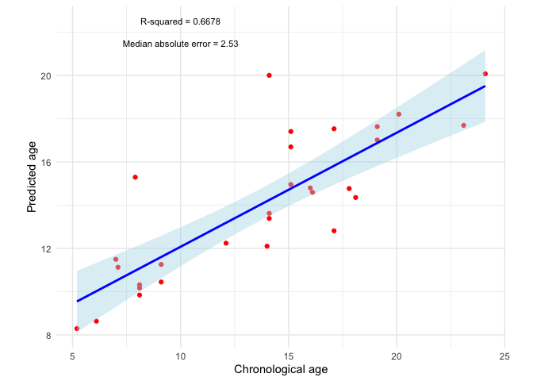
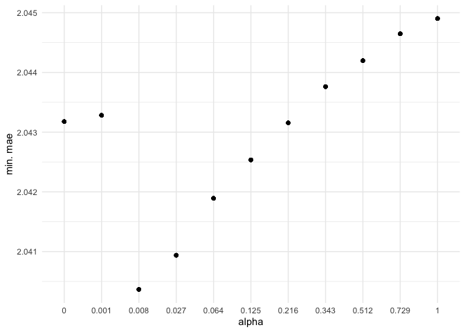
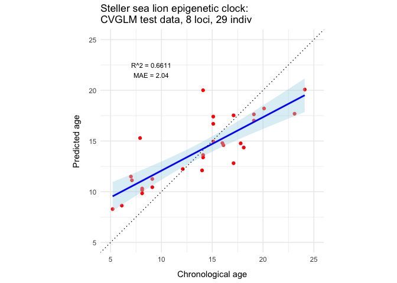

model-validation
================
diana baetscher
2025-06-03

Based off of Charles’s original analysis, which was using code from Nick
Weber. Here I’ve modified things a bit - updating the final model runs
using the optimal alpha parameter value based on the analysis of alpha.
I’m also curious about the use of Pearson’s correlations in addition to
the glmnet weight coefficients for filtering informative loci. I toyed
with those a bit and basically assumed that we should keep all 12 loci
(actually 11 because LOC114 had no usable CpG methylation) unless they
are undermining the relationship between CpG methylation and age. I
think this is slightly different than filtering that one might do with
RADseq or WGS data for identifying a smaller number of age-informative
CpG sites.

``` r
library(stringr)
library(paletteer)
library(ggplot2)
library(RcppParallel)
library(tidyr)
library(multidplyr)
library(emmeans)
library(coda)
library(igraph)
```

    ## 
    ## Attaching package: 'igraph'

    ## The following object is masked from 'package:tidyr':
    ## 
    ##     crossing

    ## The following objects are masked from 'package:stats':
    ## 
    ##     decompose, spectrum

    ## The following object is masked from 'package:base':
    ## 
    ##     union

``` r
library(psych)
```

    ## 
    ## Attaching package: 'psych'

    ## The following objects are masked from 'package:ggplot2':
    ## 
    ##     %+%, alpha

``` r
library(glmnetUtils)
library(glmnet)
```

    ## Loading required package: Matrix

    ## 
    ## Attaching package: 'Matrix'

    ## The following objects are masked from 'package:tidyr':
    ## 
    ##     expand, pack, unpack

    ## Loaded glmnet 4.1-8

    ## 
    ## Attaching package: 'glmnet'

    ## The following objects are masked from 'package:glmnetUtils':
    ## 
    ##     cv.glmnet, glmnet

``` r
library(Matrix)
library(Metrics)
```

``` r
library(rstan)
```

    ## Loading required package: StanHeaders

    ## 
    ## rstan version 2.32.3 (Stan version 2.26.1)

    ## For execution on a local, multicore CPU with excess RAM we recommend calling
    ## options(mc.cores = parallel::detectCores()).
    ## To avoid recompilation of unchanged Stan programs, we recommend calling
    ## rstan_options(auto_write = TRUE)
    ## For within-chain threading using `reduce_sum()` or `map_rect()` Stan functions,
    ## change `threads_per_chain` option:
    ## rstan_options(threads_per_chain = 1)

    ## 
    ## Attaching package: 'rstan'

    ## The following object is masked from 'package:psych':
    ## 
    ##     lookup

    ## The following object is masked from 'package:coda':
    ## 
    ##     traceplot

    ## The following object is masked from 'package:tidyr':
    ## 
    ##     extract

``` r
library(rstanarm)
```

    ## Loading required package: Rcpp

    ## 
    ## Attaching package: 'Rcpp'

    ## The following object is masked from 'package:RcppParallel':
    ## 
    ##     LdFlags

    ## This is rstanarm version 2.26.1

    ## - See https://mc-stan.org/rstanarm/articles/priors for changes to default priors!

    ## - Default priors may change, so it's safest to specify priors, even if equivalent to the defaults.

    ## - For execution on a local, multicore CPU with excess RAM we recommend calling

    ##   options(mc.cores = parallel::detectCores())

    ## 
    ## Attaching package: 'rstanarm'

    ## The following object is masked from 'package:rstan':
    ## 
    ##     loo

    ## The following object is masked from 'package:Metrics':
    ## 
    ##     se

    ## The following object is masked from 'package:psych':
    ## 
    ##     logit

``` r
library(tidyverse)
```

    ## ── Attaching core tidyverse packages ──────────────────────── tidyverse 2.0.0 ──
    ## ✔ dplyr     1.1.4     ✔ purrr     1.0.2
    ## ✔ forcats   1.0.0     ✔ readr     2.1.4
    ## ✔ lubridate 1.9.3     ✔ tibble    3.2.1

    ## ── Conflicts ────────────────────────────────────────── tidyverse_conflicts() ──
    ## ✖ lubridate::%--%()      masks igraph::%--%()
    ## ✖ psych::%+%()           masks ggplot2::%+%()
    ## ✖ psych::alpha()         masks ggplot2::alpha()
    ## ✖ dplyr::as_data_frame() masks tibble::as_data_frame(), igraph::as_data_frame()
    ## ✖ purrr::compose()       masks igraph::compose()
    ## ✖ igraph::crossing()     masks tidyr::crossing()
    ## ✖ Matrix::expand()       masks tidyr::expand()
    ## ✖ rstan::extract()       masks tidyr::extract()
    ## ✖ dplyr::filter()        masks stats::filter()
    ## ✖ dplyr::lag()           masks stats::lag()
    ## ✖ Matrix::pack()         masks tidyr::pack()
    ## ✖ purrr::simplify()      masks igraph::simplify()
    ## ✖ Matrix::unpack()       masks tidyr::unpack()
    ## ℹ Use the conflicted package (<http://conflicted.r-lib.org/>) to force all conflicts to become errors

``` r
dataM <- read_csv("outputs/SSL_singleplex_bismark_output.csv") # output from Bismark
```

    ## Rows: 1140 Columns: 16
    ## ── Column specification ────────────────────────────────────────────────────────
    ## Delimiter: ","
    ## chr  (1): locus
    ## dbl (13): sample, Total Reads, Aligned Reads, Unaligned Reads, Ambiguously A...
    ## lgl  (2): Duplicate Reads (removed), Unique Reads (remaining)
    ## 
    ## ℹ Use `spec()` to retrieve the full column specification for this data.
    ## ℹ Specify the column types or set `show_col_types = FALSE` to quiet this message.

``` r
# reformat into wide format, just the CpG methylation sites
dataM_wide <- dataM %>%
  mutate(beta = `Methylated CpGs`/(`Methylated CpGs`+`Unmethylated CpGs`)) %>%
  select(sample, locus, beta) %>%
  pivot_wider(names_from = locus, values_from = beta) %>%
  select(-LOC114) # these values are zeros and NAs

# read in and add metadata
meta <- read_csv("../data/Ejubatus_ABLG_export_20250506.csv")
```

    ## Rows: 130 Columns: 68
    ## ── Column specification ────────────────────────────────────────────────────────
    ## Delimiter: ","
    ## chr (20): AlternateID, CommonNameOLD, FamilyOLD, GenusOLD, SpeciesNameOLD, D...
    ## dbl  (8): ABLG, CollectionYear, CollectionMonth, CollectionDay, StartLatitud...
    ## lgl (40): Collector, CollectionDate, MarineRegion, FreshwaterWatershed, Loca...
    ## 
    ## ℹ Use `spec()` to retrieve the full column specification for this data.
    ## ℹ Specify the column types or set `show_col_types = FALSE` to quiet this message.

``` r
# add ages to the methylation data
m_df <- dataM_wide %>%
  left_join(., meta, by = c("sample" = "ABLG")) %>%
  select(sample, AgeYRS, c(1:12))

# trimming first column on the dataframe
ids <- m_df$sample
methyl_values <- m_df[,-1]
```

``` r
# 70/30 split

# Determine the number of rows and split indices
set.seed(42)
n_rows <- nrow(methyl_values)
train_indices <- sample(n_rows, size = (n_rows*0.7), replace = F)

# split the data
train_data <- methyl_values[train_indices, ]
test_data <- methyl_values[-train_indices, ]

# trimming first column on the testing and training dataset
# this removes the age information
# train_data <- train_data[,-1]
# test_data <- test_data[,-1]
```

### Modeling

Using the glmnet package, typical to do cross-validation on the training
set to determine the optimal penalty parameter (lambda) 10-fold

First, work with the training dataset

Documentation here: <https://glmnet.stanford.edu/reference/glmnet.html>

``` r
# this uses a cross-validated GLM
CVGLM <- glmnet::cv.glmnet(x = as.matrix(train_data[,-1]), # input matrix, minus response variable
                   y = as.matrix(train_data[,1]), # age information (response)
                   alpha = 0, # elastic net mixing parameter: can be empirically determined between 0-1
                   nfolds = nrow(methyl_values), # with this parameter, we're using leave-one-out cross-validation
                   type.measure = "mae",
                   family = "gaussian",
                   grouped = FALSE)

min(CVGLM$cvm)
```

    ## [1] 2.180995

``` r
CVGLM
```

    ## 
    ## Call:  glmnet::cv.glmnet(x = as.matrix(train_data[, -1]), y = as.matrix(train_data[,      1]), type.measure = "mae", nfolds = nrow(methyl_values),      grouped = FALSE, alpha = 0, family = "gaussian") 
    ## 
    ## Measure: Mean Absolute Error 
    ## 
    ##     Lambda Index Measure     SE Nonzero
    ## min  0.993    88   2.181 0.1984      11
    ## 1se  6.381    68   2.373 0.2006      11

``` r
z <- lapply(1:nrow(train_data), function(x){
  
  fit <- glmnet::glmnet(
                x = as.matrix(train_data[-x,-1]),
                y = as.matrix(train_data[-x,1]),
                alpha = 0.05,
                lambda = CVGLM$lambda.min, # lambda is derived from the training data model
                family="gaussian")

   pred <- predict(fit, as.matrix(train_data[x,-1]), type = "response")

  return(data.frame(pred, true = train_data[x,1]))
})

z <- do.call(rbind, z)

colnames(z) <- c("PredictedAge", "ChronologicalAge")
z 
```

    ##    PredictedAge ChronologicalAge
    ## 1      9.155976              5.9
    ## 2     14.349952             20.1
    ## 3     20.062541             15.1
    ## 4     10.742789              6.0
    ## 5     14.008678             17.1
    ## 6     10.486956              9.1
    ## 7      8.604022              8.0
    ## 8     12.272312             11.1
    ## 9     13.811616             13.0
    ## 10    13.855214             15.1
    ## 11    15.451394             18.1
    ## 12    10.473209             11.1
    ## 13    17.141459             17.1
    ## 14    14.069755             16.0
    ## 15    12.465281             17.1
    ## 16    20.466222             18.1
    ## 17    22.954651             24.1
    ## 18    16.046513             15.1
    ## 19    18.134643             18.1
    ## 20    12.589221             14.1
    ## 21    15.956865             16.1
    ## 22    12.976162              9.1
    ## 23     8.320601              9.1
    ## 24    21.377363             16.1
    ## 25    11.784073             16.8
    ## 26    10.116512              9.1
    ## 27     9.388597              6.1
    ## 28    21.225629             23.1
    ## 29     9.048636             10.4
    ## 30    10.963522             13.1
    ## 31    17.172751             17.1
    ## 32     4.453735              6.2
    ## 33    17.509940             20.1
    ## 34    13.970840             14.1
    ## 35    14.612287             11.3
    ## 36    12.267122             15.1
    ## 37    10.331963              9.1
    ## 38    16.758805             19.1
    ## 39    13.264635             14.1
    ## 40    10.786697              7.0
    ## 41     9.880918              8.1
    ## 42    14.901823             14.1
    ## 43    17.526304             18.1
    ## 44    14.751552             14.1
    ## 45    10.055667              6.1
    ## 46    14.893331             15.1
    ## 47    14.527961             12.1
    ## 48    14.808944             18.1
    ## 49    15.208183             17.1
    ## 50    19.297031             16.1
    ## 51    11.965221             18.4
    ## 52    14.972137             11.1
    ## 53    13.346507             17.1
    ## 54    11.781236             12.1
    ## 55    23.643430             24.1
    ## 56    13.490869             17.1
    ## 57    15.688507             13.1
    ## 58    14.356914             17.1
    ## 59    18.357442             18.0
    ## 60    16.303952             18.1
    ## 61    12.899290             12.2
    ## 62    15.105257             13.8
    ## 63    13.117793             15.1
    ## 64    10.592567              8.1
    ## 65    11.616707             10.4
    ## 66    10.431174              5.2

``` r
regression_FCs <- lm(z$ChronologicalAge ~ z$PredictedAge)
summary(regression_FCs)
```

    ## 
    ## Call:
    ## lm(formula = z$ChronologicalAge ~ z$PredictedAge)
    ## 
    ## Residuals:
    ##     Min      1Q  Median      3Q     Max 
    ## -5.2281 -1.6813  0.0778  1.9272  6.4454 
    ## 
    ## Coefficients:
    ##                Estimate Std. Error t value Pr(>|t|)    
    ## (Intercept)     0.04777    1.32725   0.036    0.971    
    ## z$PredictedAge  0.99512    0.09178  10.843 3.95e-16 ***
    ## ---
    ## Signif. codes:  0 '***' 0.001 '**' 0.01 '*' 0.05 '.' 0.1 ' ' 1
    ## 
    ## Residual standard error: 2.748 on 64 degrees of freedom
    ## Multiple R-squared:  0.6475, Adjusted R-squared:  0.642 
    ## F-statistic: 117.6 on 1 and 64 DF,  p-value: 3.949e-16

``` r
#MAE (median absolute error) on testing dataset
mae(z$ChronologicalAge, z$PredictedAge)
```

    ## [1] 2.18456

``` r
#Calculate residuals on testing dataset
z$Residuals <- z$PredictedAge - z$ChronologicalAge

#Calculate relative error on testing dataset
z$RelativeError <- abs(z$Residuals) / z$ChronologicalAge
regression_error <- lm(z$RelativeError ~ z$ChronologicalAge)
summary(regression_error)
```

    ## 
    ## Call:
    ## lm(formula = z$RelativeError ~ z$ChronologicalAge)
    ## 
    ## Residuals:
    ##      Min       1Q   Median       3Q      Max 
    ## -0.25135 -0.12990 -0.02006  0.09144  0.61511 
    ## 
    ## Coefficients:
    ##                     Estimate Std. Error t value Pr(>|t|)    
    ## (Intercept)         0.509793   0.064385   7.918 4.50e-11 ***
    ## z$ChronologicalAge -0.022868   0.004383  -5.217 2.09e-06 ***
    ## ---
    ## Signif. codes:  0 '***' 0.001 '**' 0.01 '*' 0.05 '.' 0.1 ' ' 1
    ## 
    ## Residual standard error: 0.1623 on 64 degrees of freedom
    ## Multiple R-squared:  0.2984, Adjusted R-squared:  0.2874 
    ## F-statistic: 27.22 on 1 and 64 DF,  p-value: 2.093e-06

``` r
# Predict
pred <- predict(CVGLM, newx = as.matrix(test_data[,-1]), s="lambda.min")

pred <- data.frame(pred)
colnames(pred) <- c("PredictedAge")
pred$ChronologicalAge <- test_data$AgeYRS

#Linear regression on test dataset
regression <- lm(pred$ChronologicalAge ~ pred$PredictedAge)
summary(regression)
```

    ## 
    ## Call:
    ## lm(formula = pred$ChronologicalAge ~ pred$PredictedAge)
    ## 
    ## Residuals:
    ##     Min      1Q  Median      3Q     Max 
    ## -7.4278 -1.1030  0.2056  1.5545  4.9659 
    ## 
    ## Coefficients:
    ##                   Estimate Std. Error t value Pr(>|t|)    
    ## (Intercept)        -4.3846     2.4534  -1.787   0.0851 .  
    ## pred$PredictedAge   1.2891     0.1703   7.569 3.84e-08 ***
    ## ---
    ## Signif. codes:  0 '***' 0.001 '**' 0.01 '*' 0.05 '.' 0.1 ' ' 1
    ## 
    ## Residual standard error: 3.01 on 27 degrees of freedom
    ## Multiple R-squared:  0.6797, Adjusted R-squared:  0.6678 
    ## F-statistic: 57.29 on 1 and 27 DF,  p-value: 3.844e-08

``` r
regression$model
```

    ##    pred$ChronologicalAge pred$PredictedAge
    ## 1                   24.1         20.074656
    ## 2                   15.1         17.405362
    ## 3                   15.1         14.954870
    ## 4                   15.1         16.693862
    ## 5                   17.8         14.767486
    ## 6                   16.1         14.594498
    ## 7                    9.1         10.445639
    ## 8                   19.1         17.631207
    ## 9                    5.2          8.290470
    ## 10                   7.9         15.291025
    ## 11                  17.1         12.813701
    ## 12                  12.1         12.241191
    ## 13                  17.1         17.530274
    ## 14                  14.1         20.002997
    ## 15                   8.1          9.843830
    ## 16                  18.1         14.354364
    ## 17                  14.1         13.623164
    ## 18                  14.1         13.384413
    ## 19                   8.1         10.318304
    ## 20                   8.1         10.166280
    ## 21                  20.1         18.206661
    ## 22                  16.0         14.795456
    ## 23                   6.1          8.634182
    ## 24                  14.0         12.101771
    ## 25                   7.1         11.126345
    ## 26                   7.0         11.494474
    ## 27                   9.1         11.257031
    ## 28                  19.1         17.011315
    ## 29                  23.1         17.689769

``` r
#MAE of test dataset
test_mae <- round(mae(pred$ChronologicalAge, pred$PredictedAge), digits = 2)
```

``` r
#Calculate residuals on test dataset
pred$Residuals <- pred$PredictedAge - pred$ChronologicalAge

#Calculate relative error on test dataset
pred$RelativeError <- abs(pred$Residuals) / pred$ChronologicalAge

regression_error <- lm(pred$RelativeError ~ pred$ChronologicalAge)
summary(regression_error)
```

    ## 
    ## Call:
    ## lm(formula = pred$RelativeError ~ pred$ChronologicalAge)
    ## 
    ## Residuals:
    ##      Min       1Q   Median       3Q      Max 
    ## -0.25825 -0.11175 -0.04454  0.10191  0.56388 
    ## 
    ## Coefficients:
    ##                        Estimate Std. Error t value Pr(>|t|)    
    ## (Intercept)            0.563132   0.096190   5.854 3.11e-06 ***
    ## pred$ChronologicalAge -0.024233   0.006576  -3.685  0.00101 ** 
    ## ---
    ## Signif. codes:  0 '***' 0.001 '**' 0.01 '*' 0.05 '.' 0.1 ' ' 1
    ## 
    ## Residual standard error: 0.1817 on 27 degrees of freedom
    ## Multiple R-squared:  0.3346, Adjusted R-squared:   0.31 
    ## F-statistic: 13.58 on 1 and 27 DF,  p-value: 0.001013

``` r
# Test for difference in residuals between training and testing datasets
var.test(z$Residuals, pred$Residuals)
```

    ## 
    ##  F test to compare two variances
    ## 
    ## data:  z$Residuals and pred$Residuals
    ## F = 0.7693, num df = 65, denom df = 28, p-value = 0.3834
    ## alternative hypothesis: true ratio of variances is not equal to 1
    ## 95 percent confidence interval:
    ##  0.3907389 1.3965525
    ## sample estimates:
    ## ratio of variances 
    ##          0.7692954

``` r
ggplot(pred, aes(x = ChronologicalAge, y = PredictedAge)) +
  geom_point(color = "red") +  # Color points red
  geom_smooth(method = "lm", se = TRUE, color = "blue", fill = "lightblue") +  # Confidence envelope with line
  labs(x = "Chronological age", y = "Predicted age") +
  coord_fixed() +  # Ensures same scale for x and y
  annotate("text", x = 10, y = 22.5, label = "R-squared = 0.6678", # from the regression model
           color = "black", size = 3) + 
  annotate("text", x = 10, y = 21.5, label = paste0("Median absolute error = ", test_mae), 
           color = "black", size = 3) +
  theme_minimal()
```

    ## `geom_smooth()` using formula = 'y ~ x'

<!-- -->

Filter CpG sites using Pearson’s correlations - Isn’t this also what the
elastic net is supposed to do?

``` r
### Perfoming a pearson’s correlations between know ages and methylation levels
#Calculate Pearson's correlations
corr_matrix <- corr.test(x = as.matrix(methyl_values[,-1]), 
                         y = methyl_values[, 1], 
                         use="pairwise", 
                         method="pearson", 
                         adjust="BH", 
                         alpha=0.05)
```

``` r
#Format dataframe
corr_results <- data.frame(corr_matrix$r, corr_matrix$p.adj)
corr_results <- tibble::rownames_to_column(corr_results, "Loc")
colnames(corr_results) <- c("Loc", "r", "padj")
corr_results$absr <- abs(corr_results$r)

# loci with the top 10% of Pearson's correlations
quantile(corr_results$absr, 0.90)
```

    ##       90% 
    ## 0.7091896

``` r
# does this filtering scheme make it relative to other loci? 
# when we would be fine keep as many loci as are providing information for the model...
```

Rather than filtering for the top 10% of Pearson’s correlations, I’ll
remove the loci with very low Pearson’s correlations (\< 0.1).

``` r
loc_highr <- corr_results %>%
  filter(absr > 0.1)
loc_percent_filt <- methyl_values %>%
  select(loc_highr$Loc, AgeYRS)
```

Rerun cv.glmnet with filtered data. Does it make a difference?

``` r
CVGLM <- cv.glmnet(x = as.matrix(loc_percent_filt[,-length(loc_percent_filt)]),
                   y = as.matrix(loc_percent_filt[,length(loc_percent_filt)]),
                   nfolds = nrow(loc_percent_filt),
                   alpha = 0, # revisit the appropriate alpha value
                   type.measure = "mae",
                   family = "gaussian",
                   grouped=FALSE)

min(CVGLM$cvm)
```

    ## [1] 2.060784

That is a smaller MAE than when using all loci.

Filtering loci using glmnet weight coefficients

``` r
# Get CpG site model coefficients
coefList <- coef(CVGLM, s=CVGLM$lambda.min)
coefList <- data.frame(coefList@Dimnames[[1]][coefList@i+1],coefList@x)
names(coefList) <- c('loc','val')
coefList <- coefList[-1, ]
colnames(coefList) <- c("Loc", "Weight")
coefList$AbsWeight <- abs(coefList$Weight)
```

``` r
# Remove CpG sites in bottom 10% of contributions
quantile(coefList$AbsWeight, 0.10)
```

    ##      10% 
    ## 17.71529

\*\*WHY USE TWO METHODS: first Pearson’s correlationa and then the
glmnet. Presumably, one could just use the GLMnet filter?

``` r
loc_highweights <- coefList %>%
  filter(AbsWeight > 17)

sealion_perc_filt <- methyl_values %>%
  select(loc_highweights$Loc, AgeYRS)
```

``` r
CVGLM <- cv.glmnet(x = as.matrix(sealion_perc_filt[,-(length(sealion_perc_filt))]),
                   y = as.matrix(sealion_perc_filt[,length(sealion_perc_filt)]),
                   nfolds = nrow(sealion_perc_filt),
                   alpha = 0, # revisit this parameter for appropriate tuning
                   type.measure = "mae",
                   family = "gaussian",
                   grouped=FALSE)

min(CVGLM$cvm)
```

    ## [1] 2.043177

That MAE is smaller than the prior filter - but it’s strange that the
absolute weight is providing much info for PBX3

### alpha parameter

Identify the optimal alpha value

``` r
x <- as.matrix(sealion_perc_filt[,-length(sealion_perc_filt)])
y <- as.matrix(sealion_perc_filt[,length(sealion_perc_filt)])

sealion_glmnet <- list()
nreps <- 10
sealion_glmnet <- lapply(1:nreps, function(i){
fit <- cva.glmnet(x = x, 
                  y = y, 
                  nfolds=nrow(sealion_perc_filt), 
                  type.measure="mae", 
                  family="gaussian", 
                  grouped=FALSE)
    sealion_glmnet$model <- fit$modlist
})

# Rename lists
prefix <- "model"
suffix <- seq(1:10)
prefix2 <- "alpha"
suffix2 <- c(0.000, 0.001, 0.008, 0.027, 0.064, 0.125, 0.216, 0.343, 0.512, 0.729, 1.000)

for (i in 1:length(sealion_glmnet)) {
  names(sealion_glmnet) <- paste(prefix, suffix, sep="_")
    for (j in 1:11) {
  names(sealion_glmnet[[i]]) <- paste(prefix2, suffix2, sep="_") 
    }
}

# Pull parameters of interest
vec <- data.frame(matrix(ncol=2))
names(vec) <- c("min.lambda", "min.mae")

for (i in 1:length(sealion_glmnet)) {
  for (j in 1:length(sealion_glmnet[[i]])) {
    vec <- rbind(vec, c(sealion_glmnet[[i]][[j]]$lambda.min, min(sealion_glmnet[[i]][[j]]$cvm)))
    }
  }
vec <- vec[-1, ]
alpha <- c(0.000, 0.001, 0.008, 0.027, 0.064, 0.125, 0.216, 0.343, 0.512, 0.729, 1.000)
vec$alpha <- rep(alpha, 10)
```

``` r
#Calculate means for each alpha value
min.mae.means <- aggregate(vec$min.mae ~ as.factor(vec$alpha), FUN=mean)
min.lambda.means <- aggregate(vec$min.lambda ~ as.factor(vec$alpha), FUN=mean)
vec.means <- cbind(min.mae.means, min.lambda.means)
vec.means <- vec.means[ ,-3]
colnames(vec.means) <- c("alpha", "mean.min.mae", "mean.min.lambda")

#Extract best parameter values
best.params <- vec.means[which.min(vec.means$mean.min.mae), ]
best.params
```

    ##   alpha mean.min.mae mean.min.lambda
    ## 3 0.008     2.040366       0.1192145

``` r
#Plot of alpha versus min.mae for each model iteration
ggplot(vec, aes(x=as.factor(alpha), y=min.mae)) +
  geom_point() +
  labs(x="alpha", y="min. mae") +
  theme_minimal()
```

<!-- -->

Note: the MAE isn’t changing by much here.

## Rerunning the model with the filtered data and optimal alpha

``` r
# 70% training and 30% test data
# Determine the number of rows and split indices
set.seed(44)
n_rows <- nrow(sealion_perc_filt)
train_indices <- sample(n_rows, size = (n_rows*0.7), replace = F)

# Split the data
train_data <- sealion_perc_filt[train_indices, ]
test_data <- sealion_perc_filt[-train_indices, ]

### trimming first column on the testing stand training dataset
#train_data <- train_data[,-1]
#test_data <- test_data[,-1]

# Verify
print(dim(train_data))
```

    ## [1] 66  9

``` r
print(dim(test_data))
```

    ## [1] 29  9

``` r
CVGLM <- cv.glmnet(x = as.matrix(train_data[,-length(train_data)]),
                   y = as.matrix(train_data[,length(train_data)]),
                   nfolds = nrow(train_data),
                   alpha = 0.008, # using the optimal value here based on the above evaluation of alpha
                   type.measure = "mae",
                   family = "gaussian",
                   grouped = FALSE)

min(CVGLM$cvm)
```

    ## [1] 2.040863

Basically the MAE value predicted in the optimal alpha analysis.

Looping over individuals to get predicted age estimates from ‘CVGLM’
generated with filtered data

``` r
z <- lapply(1:nrow(train_data), function(x){
  fit <- glmnet(
                x = as.matrix(train_data[-x,-length(train_data)]),
                y = as.matrix(train_data[-x,length(train_data)]),
                alpha = 0.008,
                lambda = CVGLM$lambda.min,
                family="gaussian")

   pred <- predict(fit, as.matrix(train_data[x,-length(train_data)]), type = "response")

  return(data.frame(pred, true = train_data[x,length(train_data)]))
})

z <- do.call(rbind, z)
colnames(z) <- c("PredictedAge", "ChronologicalAge")
z
```

    ##    PredictedAge ChronologicalAge
    ## 1     11.996230             14.0
    ## 2     16.431498             11.1
    ## 3      9.673736              8.1
    ## 4     18.135395             20.1
    ## 5     16.384861             17.8
    ## 6     24.083803             24.1
    ## 7     20.481350             24.1
    ## 8     20.621023             24.1
    ## 9     14.475043             14.1
    ## 10    15.816529             16.1
    ## 11    21.761919             20.1
    ## 12     8.054618              5.2
    ## 13    10.452030              9.1
    ## 14    19.168480             18.1
    ## 15     8.740912              5.9
    ## 16    15.166169             15.1
    ## 17    10.708473              7.0
    ## 18    15.844300             18.1
    ## 19    20.748108             16.1
    ## 20    16.374538             18.1
    ## 21    10.783650             10.4
    ## 22     9.212390             10.4
    ## 23     9.966782              9.1
    ## 24    12.479387             15.1
    ## 25    14.473343             16.0
    ## 26    15.665179             15.1
    ## 27    13.099010             14.1
    ## 28    14.165039             15.1
    ## 29    14.140552             14.1
    ## 30    12.460437             12.1
    ## 31    17.826141             18.0
    ## 32    13.637155             18.4
    ## 33    14.717052             18.1
    ## 34     9.909367             13.1
    ## 35    13.796113             15.1
    ## 36    14.725467             14.1
    ## 37    13.021519             17.1
    ## 38    14.349952             16.0
    ## 39    18.041866             19.1
    ## 40    17.602519             19.1
    ## 41    16.115297             15.1
    ## 42    15.713426             14.1
    ## 43    18.457643             18.1
    ## 44    12.573043             17.1
    ## 45     8.173020              6.1
    ## 46    21.179355             14.1
    ## 47     9.352318              6.1
    ## 48    15.132581             13.8
    ## 49    12.075980             12.1
    ## 50    22.039985             16.1
    ## 51    15.971937             17.1
    ## 52    15.731151             17.1
    ## 53    13.447197             14.1
    ## 54    13.375358              9.1
    ## 55    14.857484             16.1
    ## 56    10.128539              8.1
    ## 57    17.552610             15.1
    ## 58    15.584313             18.1
    ## 59    14.400008             11.3
    ## 60     3.283102              6.2
    ## 61    15.257163             15.1
    ## 62    22.519133             23.1
    ## 63    13.034708             13.0
    ## 64    10.678948              7.0
    ## 65    15.603703             17.1
    ## 66    10.400138             16.8

``` r
#Linear regression on testing dataset
regression_FCs <- lm(z$ChronologicalAge ~ z$PredictedAge)
summary(regression_FCs)
```

    ## 
    ## Call:
    ## lm(formula = z$ChronologicalAge ~ z$PredictedAge)
    ## 
    ## Residuals:
    ##     Min      1Q  Median      3Q     Max 
    ## -6.6662 -1.4973  0.1495  1.5983  6.1075 
    ## 
    ## Coefficients:
    ##                Estimate Std. Error t value Pr(>|t|)    
    ## (Intercept)     0.97300    1.24828   0.779    0.439    
    ## z$PredictedAge  0.93455    0.08267  11.305   <2e-16 ***
    ## ---
    ## Signif. codes:  0 '***' 0.001 '**' 0.01 '*' 0.05 '.' 0.1 ' ' 1
    ## 
    ## Residual standard error: 2.656 on 64 degrees of freedom
    ## Multiple R-squared:  0.6663, Adjusted R-squared:  0.6611 
    ## F-statistic: 127.8 on 1 and 64 DF,  p-value: < 2.2e-16

``` r
#MAE on testing dataset
opt_model_mae <- round(mae(z$ChronologicalAge, z$PredictedAge), digits = 2)

opt_model_mae
```

    ## [1] 2.04

``` r
#Calculate residuals on testing dataset
z$Residuals <- z$PredictedAge - z$ChronologicalAge

#Calculate relative error on testing dataset
z$RelativeError <- abs(z$Residuals) / z$ChronologicalAge
regression_error <- lm(z$RelativeError ~ z$ChronologicalAge)
summary(regression_error)
```

    ## 
    ## Call:
    ## lm(formula = z$RelativeError ~ z$ChronologicalAge)
    ## 
    ## Residuals:
    ##     Min      1Q  Median      3Q     Max 
    ## -0.2164 -0.1025 -0.0271  0.1130  0.3240 
    ## 
    ## Coefficients:
    ##                     Estimate Std. Error t value Pr(>|t|)    
    ## (Intercept)         0.462066   0.056146   8.230 1.27e-11 ***
    ## z$ChronologicalAge -0.020141   0.003675  -5.481 7.65e-07 ***
    ## ---
    ## Signif. codes:  0 '***' 0.001 '**' 0.01 '*' 0.05 '.' 0.1 ' ' 1
    ## 
    ## Residual standard error: 0.1352 on 64 degrees of freedom
    ## Multiple R-squared:  0.3194, Adjusted R-squared:  0.3088 
    ## F-statistic: 30.04 on 1 and 64 DF,  p-value: 7.648e-07

``` r
ggplot(pred, aes(x = ChronologicalAge, y = PredictedAge)) +
  geom_point(color = "red") +  # Color points red
  geom_smooth(method = "lm", se = TRUE, color = "blue", fill = "lightblue") +  # Confidence envelope with line - seems like the SE could be based on the data?
  labs(x = "Chronological age", y = "Predicted age") +
  coord_fixed() +  # Ensures same scale for x and y
  annotate("text", x = 9, y = 22.5, label = "R^2 = 0.6611", # I can't figure out how to call this directly from the model
           color = "black", size = 3) + 
  annotate("text", x = 9, y = 21.5, label = paste0("MAE = ", opt_model_mae), 
           color = "black", size = 3) +
  theme_minimal() +
  scale_x_continuous(limits = c(5, 25)) +
  scale_y_continuous(limits = c(5, 25)) +
  geom_abline(slope = 1, color = "black", linetype = "dotted") +
  theme(
    axis.title.x = element_text(margin = margin(t = 10)),
    axis.title.y = element_text(margin = margin(r = 10))
  ) +
  labs(title = "Steller sea lion epigenetic clock:\nCVGLM test data, 8 loci, 29 indiv")
```

    ## `geom_smooth()` using formula = 'y ~ x'

<!-- -->

``` r
ggsave("outputs/ssl_modeled_output.png", width = 8, height = 6)
```

    ## `geom_smooth()` using formula = 'y ~ x'
