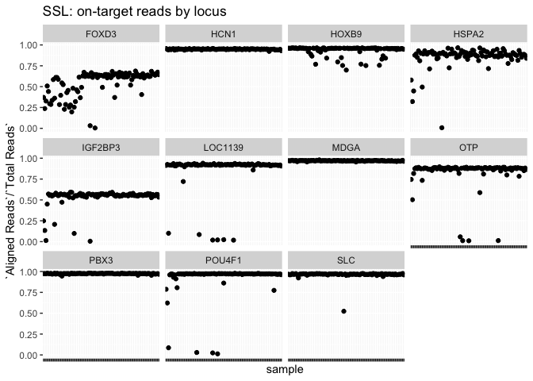
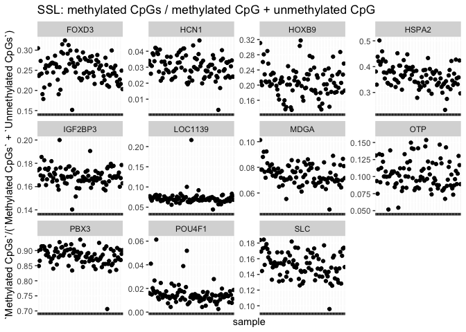
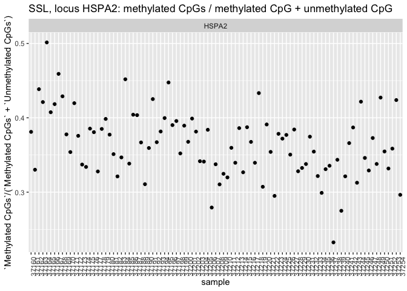
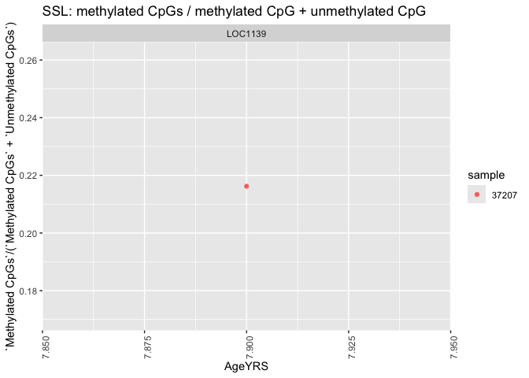
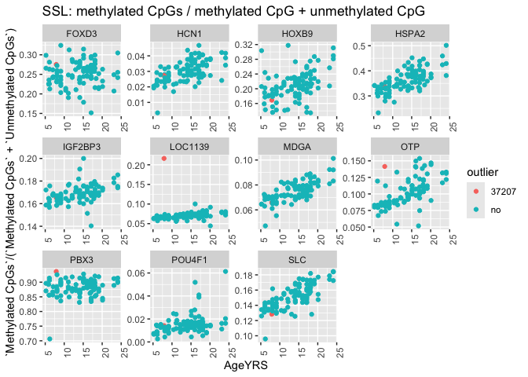

singleplex_loci
================
diana baetscher
2025-05-19

# Quick look at methylation patterns in targeted loci for Steller Sea Lions

Bismarck output from Charles for 11/12 loci

``` r
library(tidyverse)
```

    ## ── Attaching core tidyverse packages ──────────────────────── tidyverse 2.0.0 ──
    ## ✔ dplyr     1.1.4     ✔ readr     2.1.4
    ## ✔ forcats   1.0.0     ✔ stringr   1.5.1
    ## ✔ ggplot2   3.5.1     ✔ tibble    3.2.1
    ## ✔ lubridate 1.9.3     ✔ tidyr     1.3.1
    ## ✔ purrr     1.0.2     
    ## ── Conflicts ────────────────────────────────────────── tidyverse_conflicts() ──
    ## ✖ dplyr::filter() masks stats::filter()
    ## ✖ dplyr::lag()    masks stats::lag()
    ## ℹ Use the conflicted package (<http://conflicted.r-lib.org/>) to force all conflicts to become errors

``` r
metadata <- read_csv("../data/Ejubatus_ABLG_export_20250506.csv") %>%
  mutate(ABLG = as.character(ABLG))
```

    ## Rows: 130 Columns: 68
    ## ── Column specification ────────────────────────────────────────────────────────
    ## Delimiter: ","
    ## chr (20): AlternateID, CommonNameOLD, FamilyOLD, GenusOLD, SpeciesNameOLD, D...
    ## dbl  (8): ABLG, CollectionYear, CollectionMonth, CollectionDay, StartLatitud...
    ## lgl (40): Collector, CollectionDate, MarineRegion, FreshwaterWatershed, Loca...
    ## 
    ## ℹ Use `spec()` to retrieve the full column specification for this data.
    ## ℹ Specify the column types or set `show_col_types = FALSE` to quiet this message.

``` r
data <- read_csv("../data/locus002_bismark_summary_report.csv")
```

    ## Rows: 1057 Columns: 15
    ## ── Column specification ────────────────────────────────────────────────────────
    ## Delimiter: ","
    ## chr  (1): File
    ## dbl (12): Total Reads, Aligned Reads, Unaligned Reads, Ambiguously Aligned R...
    ## lgl  (2): Duplicate Reads (removed), Unique Reads (remaining)
    ## 
    ## ℹ Use `spec()` to retrieve the full column specification for this data.
    ## ℹ Specify the column types or set `show_col_types = FALSE` to quiet this message.

``` r
sample_df <- data %>%
  mutate(File = str_replace(File, "/home/cgumbi/methylation/sea_lion/bismark_output/locus002/alignment/", "")) %>%
  mutate(File = str_replace(File, "_S*_*_L001_R1_trimmed_bismark_bt2_pe.bam", "")) %>%
  separate(File, into = c("sample", "locus")) %>%
  filter(!locus %in% c("S0", "SSL"))
```

    ## Warning: Expected 2 pieces. Additional pieces discarded in 1057 rows [1, 2, 3, 4, 5, 6,
    ## 7, 8, 9, 10, 11, 12, 13, 14, 15, 16, 17, 18, 19, 20, ...].

``` r
sample_df %>%
  ggplot(aes(x = sample, y = `Aligned Reads`/`Total Reads`)) +
  geom_point() +
  facet_wrap(.~locus) +
  theme(
    axis.text.x = element_blank()
  ) +
  labs(title = "SSL: on-target reads by locus")
```

<!-- -->

``` r
sample_df %>%
  ggplot(aes(x = sample, y = `Methylated CpGs`/(`Methylated CpGs` + `Unmethylated CpGs`))) +
  geom_point() +
  facet_wrap(.~locus, scales = "free") +
  theme(
    axis.text.x = element_blank()
  ) +
  labs(title = "SSL: methylated CpGs / methylated CpG + unmethylated CpG")
```

<!-- -->

It doesn’t look like a ton of variation in methylation level across
samples within a locus. Let’s look at HSPA2 closer as an example.

``` r
sample_df %>%
  filter(locus == "HSPA2") %>%
  ggplot(aes(x = sample, y = `Methylated CpGs`/(`Methylated CpGs` + `Unmethylated CpGs`))) +
  geom_point() +
  facet_wrap(.~locus) +
  theme(
    axis.text.x = element_text(angle = 90)
  ) +
  labs(title = "SSL, locus HSPA2: methylated CpGs / methylated CpG + unmethylated CpG")
```

<!-- -->
Actually, that’s a decent spread: \<25% methylated CpGs to \>50% CpGs.

Is it correlated with age though?

``` r
sample_df %>%
  filter(locus == "HSPA2") %>%
  left_join(., metadata, by = c("sample" = "ABLG")) %>%
  ggplot(aes(x = AgeYRS, y = `Methylated CpGs`/(`Methylated CpGs` + `Unmethylated CpGs`))) +
  geom_point() +
  facet_wrap(.~locus) +
  theme(
    axis.text.x = element_text(angle = 90)
  ) +
  labs(title = "SSL, locus HSPA2: methylated CpGs / methylated CpG + unmethylated CpG")
```

<!-- --> Cool!
Looks like there’s information in that locus.

Let’s look at the rest?

``` r
sample_df %>%
  left_join(., metadata, by = c("sample" = "ABLG")) %>%
  ggplot(aes(x = AgeYRS, y = `Methylated CpGs`/(`Methylated CpGs` + `Unmethylated CpGs`))) +
  geom_point() +
  facet_wrap(.~locus, scales = "free") +
  theme(
    axis.text.x = element_text(angle = 90)
  ) +
  labs(title = "SSL: methylated CpGs / methylated CpG + unmethylated CpG")
```

<!-- -->

``` r
ggsave("outputs/Methylated_CpGs_by_locus.png", width = 10, height = 8)
```

``` r
sample_df %>%
  filter(locus == "LOC1139" & `Methylated CpGs`/(`Methylated CpGs` + `Unmethylated CpGs`) > 0.2) %>%
  left_join(., metadata, by = c("sample" = "ABLG")) %>%
  ggplot(aes(x = AgeYRS, y = `Methylated CpGs`/(`Methylated CpGs` + `Unmethylated CpGs`), color = sample)) +
  geom_point() +
  facet_wrap(.~locus, scales = "free") +
  theme(
    axis.text.x = element_text(angle = 90)
  ) +
  labs(title = "SSL: methylated CpGs / methylated CpG + unmethylated CpG")
```

<!-- -->

``` r
sample_df %>%
  mutate(outlier = ifelse(sample == "37207", "37207", "no")) %>%
  left_join(., metadata, by = c("sample" = "ABLG")) %>%
  ggplot(aes(x = AgeYRS, y = `Methylated CpGs`/(`Methylated CpGs` + `Unmethylated CpGs`), color = outlier)) +
  geom_point() +
  facet_wrap(.~locus, scales = "free") +
  theme(
    axis.text.x = element_text(angle = 90)
  ) +
  labs(title = "SSL: methylated CpGs / methylated CpG + unmethylated CpG")
```

<!-- -->
