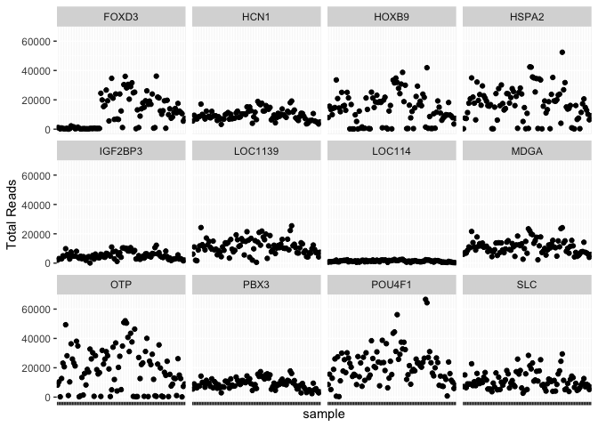
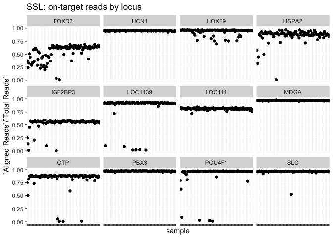
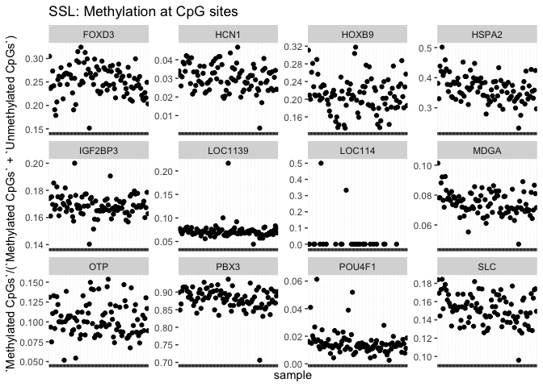
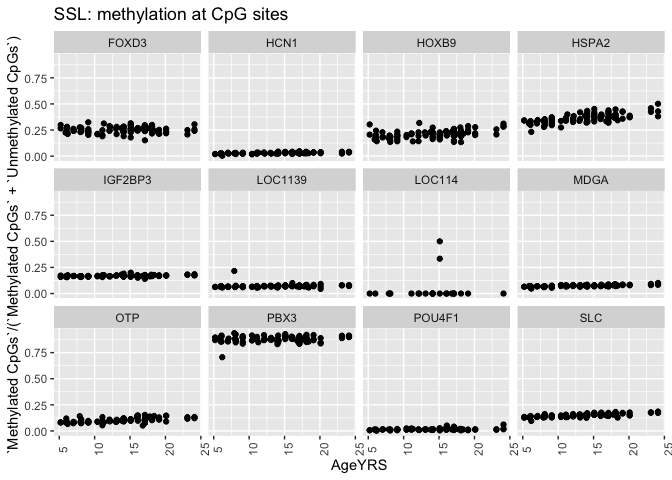
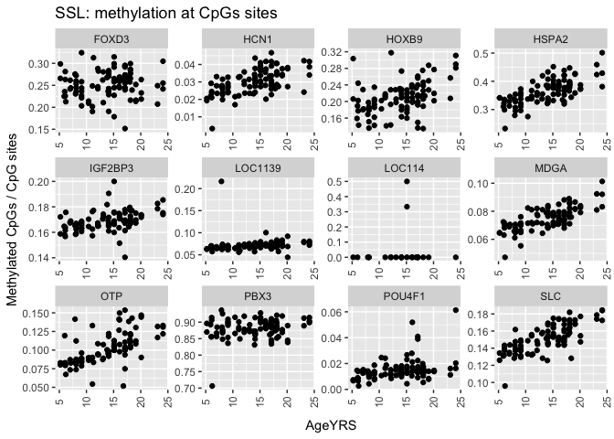
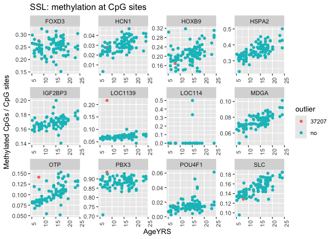
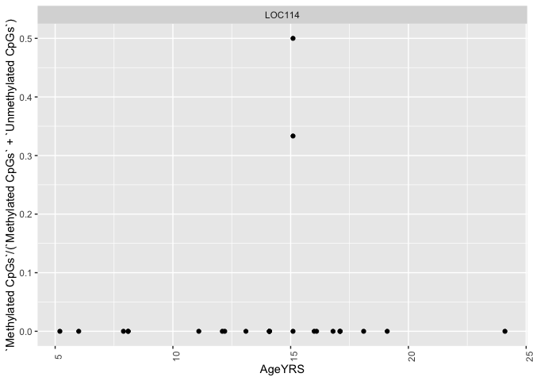

singleplex_loci
================
diana baetscher
2025-05-19

# Quick look at methylation patterns in targeted loci for Steller Sea Lions

Bismarck output from Charles for 12 loci amplified and barcoded
individually and then sequenced with the MiSeq V3 paired-end, 2x75 bp
sequencing.

``` r
library(tidyverse)
```

    ## ── Attaching core tidyverse packages ──────────────────────── tidyverse 2.0.0 ──
    ## ✔ dplyr     1.1.4     ✔ readr     2.1.4
    ## ✔ forcats   1.0.0     ✔ stringr   1.5.1
    ## ✔ ggplot2   3.5.1     ✔ tibble    3.2.1
    ## ✔ lubridate 1.9.3     ✔ tidyr     1.3.1
    ## ✔ purrr     1.0.2     
    ## ── Conflicts ────────────────────────────────────────── tidyverse_conflicts() ──
    ## ✖ dplyr::filter() masks stats::filter()
    ## ✖ dplyr::lag()    masks stats::lag()
    ## ℹ Use the conflicted package (<http://conflicted.r-lib.org/>) to force all conflicts to become errors

``` r
metadata <- read_csv("../data/Ejubatus_ABLG_export_20250506.csv") %>%
  mutate(ABLG = as.character(ABLG))
```

    ## Rows: 130 Columns: 68
    ## ── Column specification ────────────────────────────────────────────────────────
    ## Delimiter: ","
    ## chr (20): AlternateID, CommonNameOLD, FamilyOLD, GenusOLD, SpeciesNameOLD, D...
    ## dbl  (8): ABLG, CollectionYear, CollectionMonth, CollectionDay, StartLatitud...
    ## lgl (40): Collector, CollectionDate, MarineRegion, FreshwaterWatershed, Loca...
    ## 
    ## ℹ Use `spec()` to retrieve the full column specification for this data.
    ## ℹ Specify the column types or set `show_col_types = FALSE` to quiet this message.

``` r
data <- read_csv("../data/locus002_bismark_summary_report.csv")
```

    ## Rows: 1057 Columns: 15
    ## ── Column specification ────────────────────────────────────────────────────────
    ## Delimiter: ","
    ## chr  (1): File
    ## dbl (12): Total Reads, Aligned Reads, Unaligned Reads, Ambiguously Aligned R...
    ## lgl  (2): Duplicate Reads (removed), Unique Reads (remaining)
    ## 
    ## ℹ Use `spec()` to retrieve the full column specification for this data.
    ## ℹ Specify the column types or set `show_col_types = FALSE` to quiet this message.

``` r
sample_df <- data %>%
  mutate(File = str_replace(File, "/home/cgumbi/methylation/sea_lion/bismark_output/locus002/alignment/", "")) %>%
  mutate(File = str_replace(File, "_S*_*_L001_R1_trimmed_bismark_bt2_pe.bam", "")) %>%
  separate(File, into = c("sample", "locus")) %>%
  filter(!locus %in% c("S0", "SSL"))
```

    ## Warning: Expected 2 pieces. Additional pieces discarded in 1057 rows [1, 2, 3, 4, 5, 6,
    ## 7, 8, 9, 10, 11, 12, 13, 14, 15, 16, 17, 18, 19, 20, ...].

``` r
loc114 <- read_csv("../data/Loci114_bismark_summary.csv") 
```

    ## Rows: 95 Columns: 15
    ## ── Column specification ────────────────────────────────────────────────────────
    ## Delimiter: ","
    ## chr  (1): File
    ## dbl (12): Total Reads, Aligned Reads, Unaligned Reads, Ambiguously Aligned R...
    ## lgl  (2): Duplicate Reads (removed), Unique Reads (remaining)
    ## 
    ## ℹ Use `spec()` to retrieve the full column specification for this data.
    ## ℹ Specify the column types or set `show_col_types = FALSE` to quiet this message.

``` r
loc114_df <- loc114 %>%
  mutate(File = str_replace(File, "./", "")) %>%
  separate(File, into = c("sample", "toss"), sep = "_S") %>%
  select(-toss) %>%
  mutate(locus = "LOC114") %>%
  select(sample, locus, everything())

# and then combine with the sample df
ssl_bismark_output <- loc114_df %>%
  bind_rows(sample_df)
```

``` r
ssl_bismark_output %>%
  ggplot(aes(x = sample, y = `Total Reads`)) +
  geom_point() +
  facet_wrap(.~locus) +
  theme(
    axis.text.x = element_blank()
  ) 
```

<!-- -->
Plenty of sequencing, even though it varies by locus.

``` r
ssl_bismark_output %>%
  ggplot(aes(x = sample, y = `Aligned Reads`/`Total Reads`)) +
  geom_point() +
  facet_wrap(.~locus) +
  theme(
    axis.text.x = element_blank()
  ) +
  labs(title = "SSL: on-target reads by locus")
```

<!-- -->

``` r
ssl_bismark_output %>%
  ggplot(aes(x = sample, y = `Methylated CpGs`/(`Methylated CpGs` + `Unmethylated CpGs`))) +
  geom_point() +
  facet_wrap(.~locus, scales = "free") +
  theme(
    axis.text.x = element_blank()
  ) +
  labs(title = "SSL: Methylation at CpG sites")
```

    ## Warning: Removed 69 rows containing missing values or values outside the scale range
    ## (`geom_point()`).

<!-- -->

Is methylation level correlated with age? Add some metadata to explore…

``` r
ssl_bismark_output %>%
  left_join(., metadata, by = c("sample" = "ABLG")) %>%
  ggplot(aes(x = AgeYRS, y = `Methylated CpGs`/(`Methylated CpGs` + `Unmethylated CpGs`))) +
  geom_point() +
  facet_wrap(.~locus) +
  theme(
    axis.text.x = element_text(angle = 90)
  ) +
  labs(title = "SSL: methylation at CpG sites")
```

    ## Warning: Removed 69 rows containing missing values or values outside the scale range
    ## (`geom_point()`).

<!-- --> Very
different background methylation levels at each locus, which sort of
obscures patterns within each locus.

``` r
ssl_bismark_output %>%
  left_join(., metadata, by = c("sample" = "ABLG")) %>%
  ggplot(aes(x = AgeYRS, y = `Methylated CpGs`/(`Methylated CpGs` + `Unmethylated CpGs`))) +
  geom_point() +
  facet_wrap(.~locus, scales = "free") +
  theme(
    axis.text.x = element_text(angle = 90, vjust = 0.5),
    axis.title.x = element_text(margin = margin(t = 10))
  ) +
  labs(title = "SSL: methylation at CpGs sites",
        y = "Methylated CpGs / CpG sites")
```

    ## Warning: Removed 69 rows containing missing values or values outside the scale range
    ## (`geom_point()`).

<!-- -->

``` r
ggsave("outputs/Methylated_CpGs_by_locus.png", width = 10, height = 8)
```

    ## Warning: Removed 69 rows containing missing values or values outside the scale range
    ## (`geom_point()`).

Are the outliers consistent across loci?

``` r
ssl_bismark_output %>%
  filter(locus == "LOC1139" & `Methylated CpGs`/(`Methylated CpGs` + `Unmethylated CpGs`) > 0.2) %>%
  left_join(., metadata, by = c("sample" = "ABLG")) %>%
  ggplot(aes(x = AgeYRS, y = `Methylated CpGs`/(`Methylated CpGs` + `Unmethylated CpGs`), color = sample)) +
  geom_point() +
  facet_wrap(.~locus, scales = "free") +
  theme(
    axis.text.x = element_text(angle = 90)
  ) +
  labs(title = "SSL: methylated CpGs / methylated CpG + unmethylated CpG")
```

<!-- -->

``` r
ssl_bismark_output %>%
  mutate(outlier = ifelse(sample == "37207", "37207", "no")) %>%
  left_join(., metadata, by = c("sample" = "ABLG")) %>%
  ggplot(aes(x = AgeYRS, y = `Methylated CpGs`/(`Methylated CpGs` + `Unmethylated CpGs`), color = outlier)) +
  geom_point() +
  facet_wrap(.~locus, scales = "free") +
  theme(
    axis.text.x = element_text(angle = 90)
  ) +
  labs(title = "SSL: methylation at CpG sites",
       y = "Methylated CpGs / CpG sites")
```

    ## Warning: Removed 69 rows containing missing values or values outside the scale range
    ## (`geom_point()`).

<!-- -->

``` r
ssl_bismark_output %>%
  filter(locus == "LOC114") %>%
  left_join(., metadata, by = c("sample" = "ABLG")) %>%
  ggplot(aes(x = AgeYRS, y = `Methylated CpGs`/(`Methylated CpGs` + `Unmethylated CpGs`))) +
  geom_point() +
  facet_wrap(.~locus, scales = "free") +
  theme(
    axis.text.x = element_text(angle = 90)
  )
```

    ## Warning: Removed 69 rows containing missing values or values outside the scale range
    ## (`geom_point()`).

<!-- -->

Output combined bismark output df for Simon, but return to the analysis
later.

``` r
ssl_bismark_output %>%
  write_csv("outputs/SSL_singleplex_bismark_output.csv")
```
